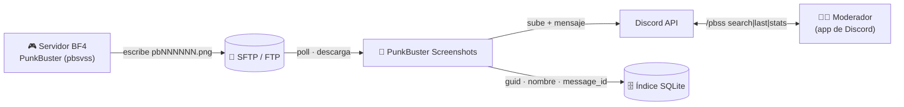
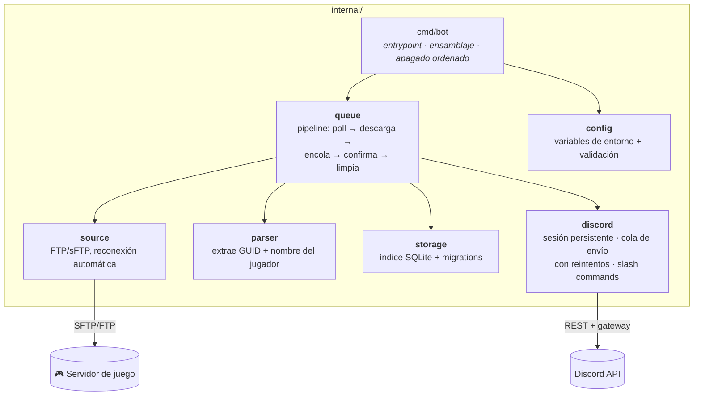
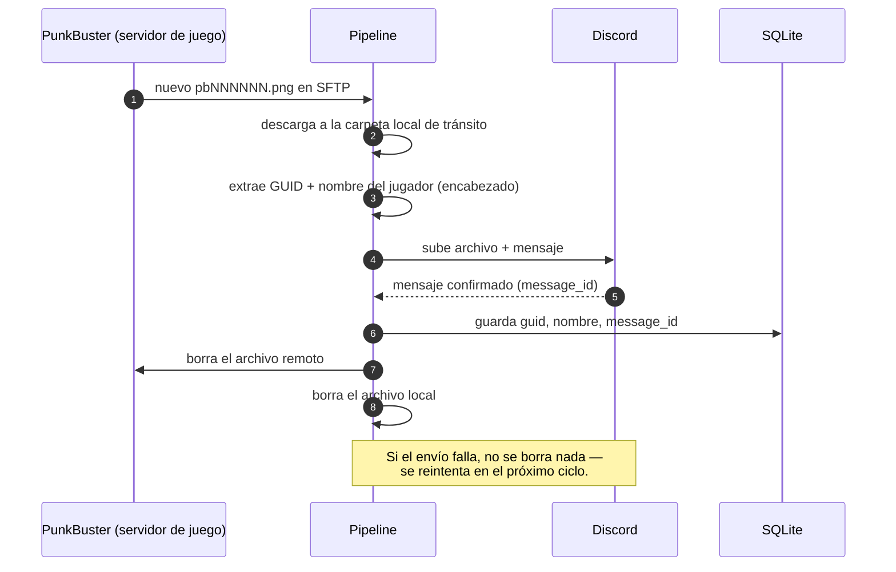

# PunkBuster Screenshots to Discord

**Monitorea un servidor FTP/sFTP de PunkBuster (BF4) en busca de capturas de detección de tramposos y entrega cada una directo a Discord — indexada y buscable por nombre o GUID del jugador.**


[English](README.md) · [Português 🇧🇷](README.pt-BR.md) · **Español 🌎**

---

## 🚀 Resumen

El anticheat de PunkBuster genera una captura de pantalla (`pbNNNNNN.png`) cada vez que marca a un jugador sospechoso, y la deja en la carpeta FTP/sFTP del servidor de juego. **PunkBuster Screenshots** monitorea esa carpeta, descarga cada captura, la publica en un canal de Discord con el **nombre del jugador + PBGUID** y — solo después de confirmar el envío del mensaje — hace la limpieza. Un índice SQLite local guarda cada GUID/nombre/mensaje, así que puedes buscar todo el historial directo desde Discord con `/pbss search`.

```text
File: pb007647.png | Created at: 2026-06-09 18:50:49
PBGUID: 5416a6f4ea15c7a4782f4bf64dab0182 JoseToalha
[captura adjunta]
```

> **Discord es el archivo permanente.** El disco del VPS es solo una cola de tránsito
> entre la descarga y la entrega confirmada — nada se guarda localmente por más de
> unas horas.

---

## ✨ Funcionalidades

| | Funcionalidad | Descripción |
|---|---|---|
| 📤 | **Pipeline con entrega confirmada** | Los archivos local y remoto se borran **solo después** de que el mensaje en Discord se confirma enviado — un envío fallido se reintenta, nunca se pierde en silencio. |
| 🔍 | **Índice buscable** | Cada captura se indexa por GUID y nombre del jugador en una base de datos SQLite local. |
| 🎮 | **Slash commands `/pbss`** | Busca, lista y estadísticas de jugadores marcados sin salir de Discord. |
| 🌐 | **FTP o sFTP** | Funciona con ambos protocolos; se reconecta solo si la conexión con el servidor de juego se cae. |
| 🧹 | **Autolimpieza** | Un "janitor" elimina cualquier archivo local olvidado tras una ventana de retención configurable (24h por defecto). |
| 🛡️ | **Sin envíos duplicados** | El seguimiento de archivos "en vuelo" evita que la misma captura se descargue y publique dos veces durante un backlog. |
| 🔑 | **Falla limpia con token inválido** | Un token de bot inválido/revocado falla rápido con un mensaje claro — sin crash-loop machacando la API de Discord. |

---

## 📑 Índice

- [🏗️ Arquitectura](#️-arquitectura)
  - [Vista del sistema](#vista-del-sistema)
  - [Arquitectura del código](#arquitectura-del-código)
  - [Anatomía de una captura](#anatomía-de-una-captura)
- [🎮 Slash Commands](#-slash-commands)
- [🚀 Inicio Rápido](#-inicio-rápido)
- [⚙️ Referencia de Configuración](#️-referencia-de-configuración)
- [🔒 Seguridad y Retención de Datos](#-seguridad-y-retención-de-datos)
- [🩺 Solución de Problemas](#-solución-de-problemas)
- [🗂️ Estructura del Proyecto](#️-estructura-del-proyecto)
- [🛣️ Roadmap](#️-roadmap)
- [🤝 Contribuir](#-contribuir)

---

## 🏗️ Arquitectura

> **¿Recién llegas?** Lee la *Vista del sistema* y pasa directo a [Inicio Rápido](#-inicio-rápido) — es todo lo que necesitas para ejecutarlo. El resto es para quienes quieren entender los detalles internos.

### Vista del sistema



### Arquitectura del código

Pequeña y en capas — el pipeline nunca habla directamente con los detalles internos de Discord/Docker, solo depende de las interfaces pequeñas que expone cada paquete. Las flechas significan *"depende de"*.



| Paquete | Responsabilidad |
|---|---|
| `cmd/bot` | Punto de entrada: carga la config, abre la base de datos y la sesión de Discord, inicia el pipeline, maneja `SIGTERM`/`SIGINT`. |
| `internal/config` | Lee y valida cada variable de entorno una sola vez, al arrancar. |
| `internal/source` | Interfaz `Source` + implementaciones FTP/sFTP, cada una reconectándose sola cuando la conexión se cae. |
| `internal/parser` | Lee el encabezado de texto fijo que PunkBuster escribe en el `.png` para extraer GUID + nombre del jugador. |
| `internal/storage` | Índice SQLite (`players`, `player_names`, `screenshots`) — esto es *solo* un índice de búsqueda, no el archivo de las capturas. |
| `internal/queue` | El pipeline: lista la carpeta remota, descarga, encola el envío, y solo confirma la limpieza tras un envío exitoso. También corre el janitor de retención. |
| `internal/discord` | Sesión persistente con el gateway, cola de envío serializada con reintentos/backoff, y los slash commands `/pbss`. |

### Anatomía de una captura



<details>
<summary><b>¿Por qué el disco local llega a guardar archivos?</b> (clic para expandir)</summary>

<br/>

Porque la subida a Discord no es instantánea, y PunkBuster puede marcar a cientos de
jugadores en picos de juego intenso (más de 2000 capturas/día). La carpeta local es una
**cola de tránsito**, no un archivo permanente: un archivo solo está ahí entre
"descargado del servidor de juego" y "confirmado como entregado en Discord". Un janitor
en segundo plano también fuerza el borrado de todo lo más viejo que `RETENTION_HOURS`
(24h por defecto) como red de seguridad, por si la entrega a Discord se traba por un
tiempo inusual — por diseño, el *mensaje en Discord* es el registro permanente, no el
archivo local.

</details>

---

## 🎮 Slash Commands

Todos los resultados son **efímeros** (solo visibles para quien ejecutó el comando).

| Comando | Qué hace |
|---|---|
| `/pbss search termo:<nombre o GUID>` | 🔍 Resultados paginados (botones ◀ ▶), cada uno con un enlace directo al mensaje original en Discord. |
| `/pbss last termo:<nombre o GUID> quantidade:<N>` | 🕒 Atajo para los últimos N resultados, sin paginación. |
| `/pbss stats` | 📊 Total de capturas, jugadores distintos marcados y el top 10 más marcados. |

```text
/pbss search termo: JoseToalha
┌──────────────────────────────────────────────┐
│ Resultados para: JoseToalha                    │
│ JoseToalha (5416a6f4ea15c7a4782f4bf64dab0182)  │
│  — 2026-06-09 18:50:49 — ver en Discord        │
│ ...                                            │
│ Página 1/3 — 12 resultado(s)   [◀ Anterior][▶] │
└──────────────────────────────────────────────┘
```

---

## 🚀 Inicio Rápido

**Necesitarás:** una máquina con Docker, acceso FTP/sFTP a la carpeta de PunkBuster en
el servidor de juego, y un token de bot de Discord.

**1. Crea el bot en Discord**
- [Discord Developer Portal](https://discord.com/developers/applications) → **New Application** → **Bot** → **Reset Token** → cópialo.
- Invítalo a tu servidor (OAuth2 → scopes `bot` + `applications.commands`).

**2. Clona y configura**

```bash
git clone https://github.com/the-eduardo/PunkBuster-Screenshots
cd PunkBuster-Screenshots
cp .env.example .env
nano .env   # completa SERVER, USER, PASS, SFTP_FOLDER, BOT_TOKEN, CHANNEL_ID
```

**3. Ejecuta**

```bash
docker compose up -d --build
```

**4. Úsalo** — escribe `/pbss stats` en tu servidor apenas lleguen las primeras capturas. 🎉

```bash
docker compose logs -f    # seguir los logs
docker compose down       # detener el bot
```

---

## ⚙️ Referencia de Configuración

Toda la configuración es vía variables de entorno (ver [`.env.example`](.env.example)).

| Variable | Obligatoria | Por defecto | Descripción |
|---|:---:|---|---|
| `SERVER` | ✅ | — | Host y puerto del FTP/sFTP, ej. `game.example.com:22`. |
| `USER` | ✅ | — | Usuario del FTP/sFTP. |
| `PASS` | ✅ | — | Contraseña del FTP/sFTP. |
| `SFTP_FOLDER` | ✅ | — | Ruta remota donde PunkBuster escribe las capturas. |
| `BOT_TOKEN` | ✅ | — | Token del bot de Discord. |
| `CHANNEL_ID` | ✅ | — | Canal de Discord donde se publican las capturas. |
| `SELECT_FTP_MODE` | ➖ | `ftp` | `ftp` o `sftp`. |
| `SFTP_HOST_KEY` | ✅ *(solo en sftp)* | — | Clave pública esperada del servidor sFTP, para que el bot distinga el servidor real de un impostor. Obtenla con `ssh-keyscan -p <puerto> -t ed25519 <host>` y **verifica la huella antes de confiar en ella**. Acepta tanto `ssh-ed25519 AAAA...` como la línea completa de `ssh-keyscan`, con el prefijo `[host]:puerto`. |
| `SFTP_INSECURE_HOST_KEY` | ➖ | `false` | Ponlo en `true` para omitir la verificación de la clave del host. No recomendado — el bot registra una advertencia al arrancar y la contraseña del sFTP queda expuesta a quien logre suplantar al servidor. |
| `WAITING_TIME` | ➖ | `30` | Minutos de espera cuando no hay capturas nuevas (2–120). |
| `SERVER_NAME` | ➖ | *(= `SERVER`)* | Etiqueta guardada en la columna `server` del índice — útil si corres más de una instancia. |
| `DISCORD_GUILD_ID` | ➖ | *(global)* | Registra `/pbss` al instante en ese servidor, en vez de esperar hasta ~1h por la propagación global. |
| `RETENTION_HOURS` | ➖ | `24` | Ventana de limpieza de seguridad para archivos locales no confirmados. |
| `DB_PATH` | ➖ | `/data/pbss.db` | Ruta del índice SQLite. |
| `TEMP_DIR` | ➖ | `/data/tmp` | Carpeta local de tránsito para descargas en curso. |
| `DEBUG_MODE` | ➖ | `false` | Logs detallados para depuración. |

---

## 🔒 Seguridad y Retención de Datos

- **El servidor sFTP se verifica, no se acepta a ciegas.** La autenticación es por contraseña, así que una máquina que suplante al servidor del juego capturaría la credencial completa. El bot compara la clave pública del servidor con `SFTP_HOST_KEY` y **falla cerrado**: sin la clave configurada se niega a arrancar, salvo que lo desactives explícitamente con `SFTP_INSECURE_HOST_KEY=true`. Si la clave deja de coincidir, el error muestra la huella esperada y la recibida — así una rotación legítima de la clave del servidor se distingue fácilmente de un ataque.
- **Las credenciales nunca llegan a git.** El `.env` está en `.gitignore`; solo se sube `.env.example` (sin valores reales). Rota `BOT_TOKEN`/`PASS` de inmediato si se filtran.
- **Discord es el archivo, no el disco.** El `TEMP_DIR` local solo guarda una captura entre la descarga y la entrega confirmada — por diseño, nunca un almacenamiento a largo plazo.
- **Garantía de entrega confirmada.** Las copias local *y* remota solo se borran **después** de que Discord confirma la creación del mensaje. Un envío fallido mantiene ambas copias y reintenta automáticamente.
- **Sin secretos incrustados en la imagen.** La imagen Docker solo trae el binario compilado + `ca-certificates`; todas las credenciales vienen del `.env` en tiempo de ejecución.

---

## 🩺 Solución de Problemas

| Síntoma | Causa y solución |
|---|---|
| El bot se cierra de inmediato con un error de config claro | Falta una variable de entorno obligatoria — el mensaje ya indica cuál. |
| `token do bot inválido ou revogado (close 4004)` | El token fue reseteado o la aplicación fue eliminada en el Developer Portal — genera un token nuevo y actualiza el `.env`. |
| Los slash commands no aparecen | Define `DISCORD_GUILD_ID` para registro instantáneo, en vez de esperar hasta ~1h por la propagación global. |
| `/pbss search` no encuentra a un jugador conocido | El índice solo tiene datos de *después* de que esta versión fue desplegada — las capturas enviadas antes no se indexan retroactivamente. |
| El uso de disco crece en `TEMP_DIR` | Revisa los logs por fallos de envío repetidos (ej. caída de Discord); los archivos más viejos que `RETENTION_HOURS` se purgan a la fuerza de todas formas. |

---

## 🗂️ Estructura del Proyecto

```text
cmd/bot/                  entrypoint (main)
internal/
  config/                 carga y valida variables de entorno
  source/                 abstracción FTP/sFTP con reconexión automática
  parser/                 extrae GUID + nombre del jugador del encabezado de la captura
  storage/                índice SQLite (players, player_names, screenshots) + migrations
  queue/                  el pipeline: poll → descarga → encola → confirma → limpia
  discord/                sesión persistente, cola de envío con reintentos, comandos /pbss
```

**Notas de diseño para los curiosos**

- **El seguimiento "en vuelo"** evita que el poller vuelva a descargar y encolar el mismo archivo remoto antes de que un envío anterior se confirme — importante cuando hay un backlog de cientos de archivos.
- **El parser lee un índice de línea fijo**, no hace un escaneo con regex: el formato del encabezado de la captura de PunkBuster no debería cambiar, así que el único caso real manejado es una línea de GUID ocasionalmente en blanco (un bug conocido de PunkBuster), no un "cambio de formato".
- **Cola de envío serializada** — el cliente REST de `discordgo` ya respeta los rate limits de Discord por ruta, así que una sola goroutine procesando envíos de a uno ya es suficiente; no hace falta un limitador propio.

---

## 🛣️ Roadmap

- [x] Pipeline con entrega confirmada (fin del borrado a ciegas)
- [x] Índice de búsqueda SQLite + slash commands `/pbss`
- [x] Corrección de reprocesamiento duplicado en escenarios de backlog
- [x] Falla limpia con token de Discord inválido (fin del crash-loop)
- [ ] Soporte multi-servidor (monitorear varios servidores de juego desde una sola instancia)
- [ ] CI (vet + build) vía GitHub Actions

---

## 🤝 Contribuir

Los issues y PRs son bienvenidos. El código es pequeño, Go idiomático, y fácil de extender — un slash command nuevo suele ser un handler más una entrada en la lista de comandos.

---

<div align="center">
<sub>Construido con <a href="https://github.com/bwmarrin/discordgo">discordgo</a> · <a href="https://github.com/jlaffaye/ftp">jlaffaye/ftp</a> · <a href="https://github.com/pkg/sftp">pkg/sftp</a> · <a href="https://gitlab.com/cznic/sqlite">modernc.org/sqlite</a>.</sub>
</div>
