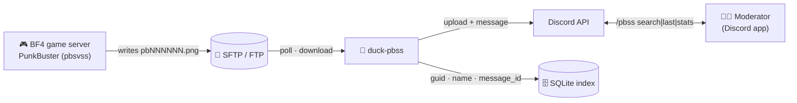
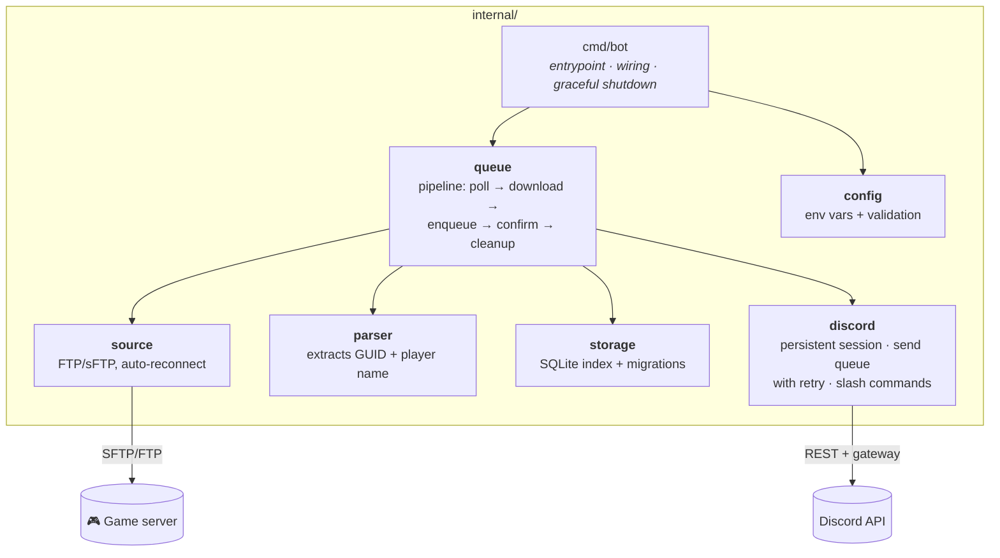
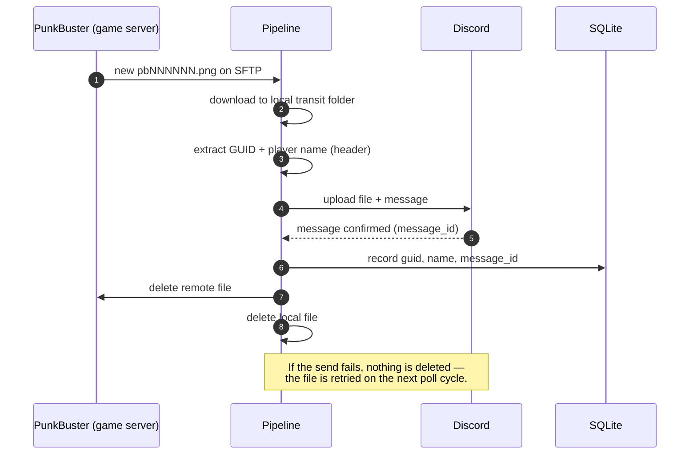

# 🦆 duck-pbss — PunkBuster Screenshots to Discord

**Watches a PunkBuster (BF4) SFTP/FTP server for cheat-detection screenshots and delivers each one straight to Discord — indexed and searchable by player name or GUID.**


**English** · [Português 🇧🇷](README.pt-BR.md) · [Español 🌎](README.es.md)

---

## 🚀 TL;DR

PunkBuster's anti-cheat generates a screenshot (`pbNNNNNN.png`) every time it flags a suspicious player, and drops it on the game server's FTP/sFTP. **duck-pbss** watches that folder, downloads each screenshot, posts it to a Discord channel with the **player name + PBGUID**, and — only after the message is confirmed sent — cleans up. A local SQLite index remembers every GUID/name/message so you can search the whole history straight from Discord with `/pbss search`.

```text
File: pb007647.png | Created at: 2026-06-09 18:50:49
PBGUID: 5416a6f4ea15c7a4782f4bf64dab0182 JoseToalha
[screenshot attached]
```

> **Discord is the permanent archive.** The VPS disk is only a transit queue between
> download and confirmed delivery — nothing is kept locally for more than a few hours.

---

## ✨ Features

| | Feature | Description |
|---|---|---|
| 📤 | **Confirmed-delivery pipeline** | Local and remote files are deleted **only after** the Discord message is confirmed sent — a failed upload is retried, never silently lost. |
| 🔍 | **Searchable index** | Every screenshot is indexed by GUID and player name in a local SQLite database. |
| 🎮 | **`/pbss` slash commands** | Search, list, and get stats on flagged players without leaving Discord. |
| 🌐 | **FTP or sFTP** | Works with either protocol; auto-reconnects if the game server connection drops. |
| 🧹 | **Self-cleaning** | A janitor purges any stuck local file after a configurable retention window (default 24h). |
| 🛡️ | **No duplicate sends** | In-flight tracking prevents the same screenshot from being downloaded and posted twice during a backlog. |
| 🔑 | **Clean failure on bad token** | An invalid/revoked bot token fails fast with a clear message — no crash-loop hammering Discord's API. |

---

## 📑 Table of Contents

- [🏗️ Architecture](#️-architecture)
  - [System view](#system-view)
  - [Code architecture](#code-architecture)
  - [Anatomy of one screenshot](#anatomy-of-one-screenshot)
- [🎮 Slash Commands](#-slash-commands)
- [🚀 Quick Start](#-quick-start)
- [⚙️ Configuration Reference](#️-configuration-reference)
- [🔒 Security & Data Retention](#-security--data-retention)
- [🩺 Troubleshooting](#-troubleshooting)
- [🗂️ Project Layout](#️-project-layout)
- [🛣️ Roadmap](#️-roadmap)
- [🤝 Contributing](#-contributing)

---

## 🏗️ Architecture

> **New here?** Read *System view* and skip to [Quick Start](#-quick-start) — that's all you need to run it. The rest is for developers who want the internals.

### System view



### Code architecture

Small and layered — the pipeline never talks to Docker/Discord internals directly, it only depends on the small interfaces each package exposes. Arrows mean *"depends on"*.



| Package | Responsibility |
|---|---|
| `cmd/bot` | Entry point: load config, open the DB and Discord session, start the pipeline, handle `SIGTERM`/`SIGINT`. |
| `internal/config` | Reads and validates every environment variable once, at boot. |
| `internal/source` | `Source` interface + FTP/sFTP implementations, each reconnecting on its own when the connection drops. |
| `internal/parser` | Reads the fixed text header PunkBuster writes into the `.png` to extract the GUID + player name. |
| `internal/storage` | SQLite index (`players`, `player_names`, `screenshots`) — this is *only* a search index, not the screenshot archive. |
| `internal/queue` | The pipeline: lists the remote folder, downloads, enqueues delivery, and only confirms cleanup after a successful send. Also runs the retention janitor. |
| `internal/discord` | Persistent gateway session, a serialized send queue with retry/backoff, and the `/pbss` slash commands. |

### Anatomy of one screenshot



<details>
<summary><b>Why does the local disk ever hold files at all?</b> (click to expand)</summary>

<br/>

Because the upload to Discord isn't instant, and PunkBuster can flag hundreds of players
during heavy play (peaks of 2000+ screenshots/day). The local folder is a **transit
queue**, not an archive: a file only sits there between "downloaded from the game
server" and "confirmed delivered to Discord". A background janitor also force-deletes
anything older than `RETENTION_HOURS` (default 24h) as a safety net, in case Discord
delivery is stuck for an unusually long time — by design, the *Discord message* is the
permanent record, not the local file.

</details>

---

## 🎮 Slash Commands

All results are **ephemeral** (only visible to whoever runs the command).

| Command | What it does |
|---|---|
| `/pbss search termo:<name or GUID>` | 🔍 Paginated results (◀ ▶ buttons), each with a direct link to the original Discord message. |
| `/pbss last termo:<name or GUID> quantidade:<N>` | 🕒 Shortcut for the last N results, no pagination. |
| `/pbss stats` | 📊 Total screenshots, distinct flagged players, and the top 10 most-flagged. |

```text
/pbss search termo: JoseToalha
┌──────────────────────────────────────────────┐
│ Results for: JoseToalha                        │
│ JoseToalha (5416a6f4ea15c7a4782f4bf64dab0182)  │
│  — 2026-06-09 18:50:49 — view on Discord       │
│ ...                                            │
│ Page 1/3 — 12 result(s)      [◀ Prev] [Next ▶] │
└──────────────────────────────────────────────┘
```

---

## 🚀 Quick Start

**You'll need:** a machine with Docker, FTP/sFTP access to the game server's PunkBuster
folder, and a Discord bot token.

**1. Create the Discord bot**
- [Discord Developer Portal](https://discord.com/developers/applications) → **New Application** → **Bot** → **Reset Token** → copy it.
- Invite it to your server (OAuth2 → scopes `bot` + `applications.commands`).

**2. Clone and configure**

```bash
git clone https://github.com/the-eduardo/PunkBuster-Screenshots duck-pbss
cd duck-pbss
cp .env.example .env
nano .env   # fill SERVER, USER, PASS, SFTP_FOLDER, BOT_TOKEN, CHANNEL_ID
```

**3. Run it**

```bash
docker compose up -d --build
```

**4. Use it** — type `/pbss stats` in your server once the first screenshots arrive. 🎉

```bash
docker compose logs -f    # follow the logs
docker compose down       # stop the bot
```

---

## ⚙️ Configuration Reference

All configuration is via environment variables (see [`.env.example`](.env.example)).

| Variable | Required | Default | Description |
|---|:---:|---|---|
| `SERVER` | ✅ | — | FTP/sFTP host and port, e.g. `game.example.com:22`. |
| `USER` | ✅ | — | FTP/sFTP username. |
| `PASS` | ✅ | — | FTP/sFTP password. |
| `SFTP_FOLDER` | ✅ | — | Remote path where PunkBuster writes screenshots. |
| `BOT_TOKEN` | ✅ | — | Discord bot token. |
| `CHANNEL_ID` | ✅ | — | Discord channel where screenshots are posted. |
| `SELECT_FTP_MODE` | ➖ | `ftp` | `ftp` or `sftp`. |
| `WAITING_TIME` | ➖ | `30` | Minutes to wait when no new screenshots are found (2–120). |
| `SERVER_NAME` | ➖ | *(= `SERVER`)* | Label stored in the index's `server` column — useful once you run more than one instance. |
| `DISCORD_GUILD_ID` | ➖ | *(global)* | Registers `/pbss` instantly on this server instead of waiting up to ~1h for global propagation. |
| `RETENTION_HOURS` | ➖ | `24` | Safety-net cleanup window for unconfirmed local files. |
| `DB_PATH` | ➖ | `/data/pbss.db` | SQLite index path. |
| `TEMP_DIR` | ➖ | `/data/tmp` | Local transit folder for in-flight downloads. |
| `DEBUG_MODE` | ➖ | `false` | Verbose logging for troubleshooting. |

---

## 🔒 Security & Data Retention

- **Credentials never touch git.** `.env` is gitignored; only `.env.example` (no real values) is committed. Rotate `BOT_TOKEN`/`PASS` immediately if they ever leak.
- **Discord is the archive, not the disk.** The local `TEMP_DIR` only ever holds a screenshot between download and confirmed delivery — by design, never a long-term store.
- **Confirmed-delivery guarantee.** Local *and* remote copies are deleted **only after** Discord confirms the message was created. A failed send keeps both copies and retries automatically.
- **No secrets baked into the image.** The Docker image ships only the compiled binary + `ca-certificates`; all credentials come from `.env` at runtime.

---

## 🩺 Troubleshooting

| Symptom | Cause & fix |
|---|---|
| Bot exits immediately with a clear config error | A required env var is missing — check the message, it names exactly which one. |
| `token do bot inválido ou revogado (close 4004)` | The bot token was reset or the app was deleted in the Developer Portal — generate a new token and update `.env`. |
| Slash commands don't appear | Set `DISCORD_GUILD_ID` for instant registration instead of waiting up to ~1h for global propagation. |
| `/pbss search` finds nothing for a known player | The index only has data from *after* this version was deployed — screenshots sent before that aren't retroactively indexed. |
| Disk usage growing under `TEMP_DIR` | Check the logs for repeated send failures (e.g. Discord outage); files older than `RETENTION_HOURS` are force-purged automatically either way. |

---

## 🗂️ Project Layout

```text
cmd/bot/                  entrypoint (main)
internal/
  config/                 loads & validates environment variables
  source/                 FTP/sFTP abstraction with auto-reconnect
  parser/                 extracts GUID + player name from the screenshot header
  storage/                SQLite index (players, player_names, screenshots) + migrations
  queue/                  the pipeline: poll → download → enqueue → confirm → cleanup
  discord/                persistent session, send queue with retry, /pbss commands
```

**Design notes for the curious**

- **In-flight tracking** prevents the poller from re-downloading and re-enqueuing the same remote file before a previous send is confirmed — important once you have a backlog of hundreds of files.
- **The parser reads a fixed line index**, not a regex scan: PunkBuster's screenshot header format is not expected to change, so the only real failure mode handled is an occasional blank GUID line (a known PunkBuster quirk), not "format drift".
- **Serialized send queue** — `discordgo`'s REST client already respects Discord's per-route rate limits, so a single worker goroutine processing sends one at a time is enough; no custom limiter needed.

---

## 🛣️ Roadmap

- [x] Confirmed-delivery pipeline (no more blind delete)
- [x] SQLite search index + `/pbss` slash commands
- [x] Duplicate-processing fix for backlog scenarios
- [x] Clean failure on invalid Discord token (no more crash-loop)
- [ ] Multi-server support (poll several game servers from one bot instance)
- [ ] CI (vet + build) via GitHub Actions

---

## 🤝 Contributing

Issues and PRs are welcome. The codebase is small, idiomatic Go, and easy to extend — a new slash command is usually one handler plus one entry in the command list.

---

<div align="center">
<sub>Built with <a href="https://github.com/bwmarrin/discordgo">discordgo</a> · <a href="https://github.com/jlaffaye/ftp">jlaffaye/ftp</a> · <a href="https://github.com/pkg/sftp">pkg/sftp</a> · <a href="https://gitlab.com/cznic/sqlite">modernc.org/sqlite</a>.</sub>
</div>
