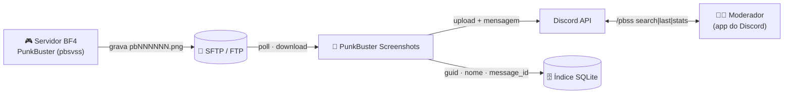
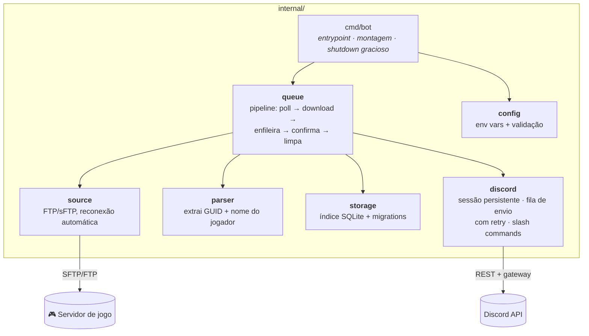
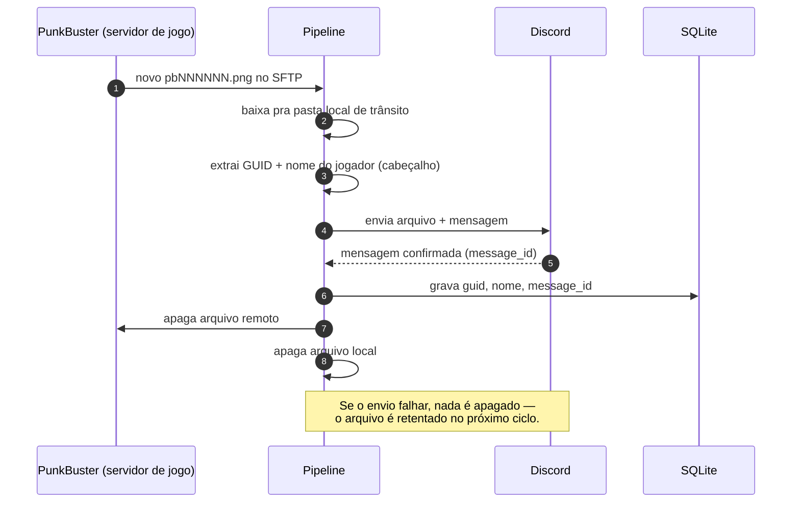

# PunkBuster Screenshots to Discord

**Monitora um servidor FTP/sFTP de PunkBuster (BF4) em busca de screenshots de detecção de cheat e entrega cada um direto no Discord — indexado e pesquisável por nome ou GUID do jogador.**


[English](README.md) · **Português 🇧🇷** · [Español 🌎](README.es.md)

---

## 🚀 Resumo

O anti-cheat do PunkBuster gera um screenshot (`pbNNNNNN.png`) toda vez que flagra um jogador suspeito, e joga isso na pasta FTP/sFTP do servidor de jogo. O **PunkBuster Screenshots** monitora essa pasta, baixa cada screenshot, posta no canal do Discord com o **nome do jogador + PBGUID** e — só depois que a mensagem é confirmada como enviada — faz a limpeza. Um índice SQLite local guarda cada GUID/nome/mensagem, então dá pra buscar todo o histórico direto do Discord com `/pbss search`.

```text
File: pb007647.png | Created at: 2026-06-09 18:50:49
PBGUID: 5416a6f4ea15c7a4782f4bf64dab0182 JoseToalha
[screenshot anexado]
```

> **O Discord é o arquivo permanente.** O disco da VPS é só uma fila de trânsito entre
> o download e a entrega confirmada — nada fica local por mais que algumas horas.

---

## ✨ Funcionalidades

| | Funcionalidade | Descrição |
|---|---|---|
| 📤 | **Pipeline com confirmação de entrega** | Arquivo local e remoto só são apagados **depois** que a mensagem no Discord é confirmada — um envio que falha é retentado, nunca perdido silenciosamente. |
| 🔍 | **Índice pesquisável** | Todo screenshot é indexado por GUID e nome do jogador num banco SQLite local. |
| 🎮 | **Slash commands `/pbss`** | Busca, lista e estatísticas de jogadores flagrados sem sair do Discord. |
| 🌐 | **FTP ou sFTP** | Funciona com os dois protocolos; reconecta sozinho se a conexão com o servidor cair. |
| 🧹 | **Autolimpeza** | Um "janitor" apaga qualquer arquivo local esquecido após uma janela de retenção configurável (padrão 24h). |
| 🛡️ | **Sem envio duplicado** | Rastreamento de arquivos "em voo" evita que o mesmo screenshot seja baixado e postado duas vezes durante um backlog. |
| 🔑 | **Falha limpa em token inválido** | Um token de bot inválido/revogado falha rápido com mensagem clara — sem crash-loop martelando a API do Discord. |

---

## 📑 Sumário

- [🏗️ Arquitetura](#️-arquitetura)
  - [Visão geral do sistema](#visão-geral-do-sistema)
  - [Arquitetura do código](#arquitetura-do-código)
  - [Anatomia de um screenshot](#anatomia-de-um-screenshot)
- [🎮 Slash Commands](#-slash-commands)
- [🚀 Começando](#-começando)
- [⚙️ Referência de Configuração](#️-referência-de-configuração)
- [🔒 Segurança e Retenção de Dados](#-segurança-e-retenção-de-dados)
- [🩺 Solução de Problemas](#-solução-de-problemas)
- [🗂️ Estrutura do Projeto](#️-estrutura-do-projeto)
- [🛣️ Roadmap](#️-roadmap)
- [🤝 Contribuindo](#-contribuindo)

---

## 🏗️ Arquitetura

> **Chegou agora?** Leia a *Visão geral do sistema* e pule direto pra [Começando](#-começando) — é só o necessário pra rodar. O resto é pra quem quer entender os detalhes internos.

### Visão geral do sistema



### Arquitetura do código

Pequena e em camadas — o pipeline nunca fala diretamente com detalhes internos do Discord/Docker, só depende das interfaces pequenas que cada pacote expõe. As setas significam *"depende de"*.



| Pacote | Responsabilidade |
|---|---|
| `cmd/bot` | Ponto de entrada: carrega config, abre o banco e a sessão do Discord, inicia o pipeline, trata `SIGTERM`/`SIGINT`. |
| `internal/config` | Lê e valida cada variável de ambiente uma única vez, na inicialização. |
| `internal/source` | Interface `Source` + implementações FTP/sFTP, cada uma reconectando sozinha quando a conexão cai. |
| `internal/parser` | Lê o cabeçalho de texto fixo que o PunkBuster grava no `.png` pra extrair GUID + nome do jogador. |
| `internal/storage` | Índice SQLite (`players`, `player_names`, `screenshots`) — isso é *só* um índice de busca, não o arquivo dos screenshots. |
| `internal/queue` | O pipeline: lista a pasta remota, baixa, enfileira o envio, e só confirma a limpeza depois de um envio bem-sucedido. Também roda o janitor de retenção. |
| `internal/discord` | Sessão persistente com o gateway, fila de envio serializada com retry/backoff, e os slash commands `/pbss`. |

### Anatomia de um screenshot



<details>
<summary><b>Por que o disco local chega a guardar arquivos?</b> (clique pra expandir)</summary>

<br/>

Porque o upload pro Discord não é instantâneo, e o PunkBuster pode flagrar centenas de
jogadores em picos de jogo intenso (mais de 2000 screenshots/dia). A pasta local é uma
**fila de trânsito**, não um arquivo permanente: um arquivo só fica lá entre "baixado do
servidor de jogo" e "confirmado como entregue no Discord". Um janitor em background
também força a exclusão de qualquer coisa mais velha que `RETENTION_HOURS` (padrão 24h)
como rede de segurança, caso a entrega ao Discord fique travada por um tempo incomum —
por design, a *mensagem no Discord* é o registro permanente, não o arquivo local.

</details>

---

## 🎮 Slash Commands

Todos os resultados são **efêmeros** (visíveis só pra quem rodou o comando).

| Comando | O que faz |
|---|---|
| `/pbss search termo:<nome ou GUID>` | 🔍 Resultados paginados (botões ◀ ▶), cada um com link direto pra mensagem original no Discord. |
| `/pbss last termo:<nome ou GUID> quantidade:<N>` | 🕒 Atalho pros últimos N resultados, sem paginação. |
| `/pbss stats` | 📊 Total de screenshots, jogadores distintos flagrados e o top 10 mais flagrados. |

```text
/pbss search termo: JoseToalha
┌──────────────────────────────────────────────┐
│ Resultados para: JoseToalha                    │
│ JoseToalha (5416a6f4ea15c7a4782f4bf64dab0182)  │
│  — 2026-06-09 18:50:49 — ver no Discord        │
│ ...                                            │
│ Página 1/3 — 12 resultado(s)  [◀ Anterior] [▶] │
└──────────────────────────────────────────────┘
```

---

## 🚀 Começando

**Você vai precisar:** uma máquina com Docker, acesso FTP/sFTP à pasta do PunkBuster no
servidor de jogo, e um token de bot do Discord.

**1. Crie o bot no Discord**
- [Discord Developer Portal](https://discord.com/developers/applications) → **New Application** → **Bot** → **Reset Token** → copie o token.
- Convide ele pro seu servidor (OAuth2 → escopos `bot` + `applications.commands`).

**2. Clone e configure**

```bash
git clone https://github.com/the-eduardo/PunkBuster-Screenshots
cd PunkBuster-Screenshots
cp .env.example .env
nano .env   # preencha SERVER, USER, PASS, SFTP_FOLDER, BOT_TOKEN, CHANNEL_ID
```

**3. Rode**

```bash
docker compose up -d --build
```

**4. Use** — digite `/pbss stats` no seu servidor assim que os primeiros screenshots chegarem. 🎉

```bash
docker compose logs -f    # acompanhar os logs
docker compose down       # parar o bot
```

---

## ⚙️ Referência de Configuração

Toda a configuração é via variáveis de ambiente (veja [`.env.example`](.env.example)).

| Variável | Obrigatória | Padrão | Descrição |
|---|:---:|---|---|
| `SERVER` | ✅ | — | Host e porta do FTP/sFTP, ex. `game.example.com:22`. |
| `USER` | ✅ | — | Usuário do FTP/sFTP. |
| `PASS` | ✅ | — | Senha do FTP/sFTP. |
| `SFTP_FOLDER` | ✅ | — | Caminho remoto onde o PunkBuster grava os screenshots. |
| `BOT_TOKEN` | ✅ | — | Token do bot do Discord. |
| `CHANNEL_ID` | ✅ | — | Canal do Discord onde os screenshots são postados. |
| `SELECT_FTP_MODE` | ➖ | `ftp` | `ftp` ou `sftp`. |
| `SFTP_HOST_KEY` | ✅ *(só no sftp)* | — | Chave pública esperada do servidor sFTP, para o bot distinguir o servidor real de um impostor. Obtenha com `ssh-keyscan -p <porta> -t ed25519 <host>` e **confira a fingerprint antes de confiar**. Aceita tanto `ssh-ed25519 AAAA...` quanto a linha inteira do `ssh-keyscan`, com o prefixo `[host]:porta`. |
| `SFTP_INSECURE_HOST_KEY` | ➖ | `false` | Defina como `true` para pular a verificação da chave do host. Não recomendado — o bot loga um aviso no boot e a senha do sFTP fica exposta a quem conseguir se passar pelo servidor. |
| `WAITING_TIME` | ➖ | `30` | Minutos de espera quando não há screenshots novos (2–120). |
| `SERVER_NAME` | ➖ | *(= `SERVER`)* | Rótulo salvo na coluna `server` do índice — útil quando você roda mais de uma instância. |
| `DISCORD_GUILD_ID` | ➖ | *(global)* | Registra `/pbss` na hora nesse servidor, em vez de esperar até ~1h pela propagação global. |
| `RETENTION_HOURS` | ➖ | `24` | Janela de limpeza de segurança pra arquivos locais não confirmados. |
| `DB_PATH` | ➖ | `/data/pbss.db` | Caminho do índice SQLite. |
| `TEMP_DIR` | ➖ | `/data/tmp` | Pasta local de trânsito pros downloads em andamento. |
| `DEBUG_MODE` | ➖ | `false` | Logs verbosos pra depuração. |

---

## 🔒 Segurança e Retenção de Dados

- **O servidor sFTP é verificado, não aceito às cegas.** A autenticação é por senha, então uma máquina se passando pelo servidor do jogo capturaria a credencial inteira. O bot confere a chave pública do servidor contra `SFTP_HOST_KEY` e **falha fechado**: sem a chave configurada, ele se recusa a iniciar, a menos que você abra mão disso explicitamente com `SFTP_INSECURE_HOST_KEY=true`. Se a chave deixar de bater, o erro mostra a fingerprint esperada e a recebida — assim uma troca legítima de chave do servidor é fácil de distinguir de um ataque.
- **Credenciais nunca vão pro git.** O `.env` está no `.gitignore`; só o `.env.example` (sem valores reais) é commitado. Rotacione `BOT_TOKEN`/`PASS` imediatamente se vazarem.
- **O Discord é o arquivo, não o disco.** O `TEMP_DIR` local só guarda um screenshot entre o download e a entrega confirmada — por design, nunca um armazenamento de longo prazo.
- **Garantia de entrega confirmada.** As cópias local *e* remota só são apagadas **depois** que o Discord confirma a criação da mensagem. Um envio que falha mantém as duas cópias e retenta automaticamente.
- **Nenhum segredo embutido na imagem.** A imagem Docker só carrega o binário compilado + `ca-certificates`; todas as credenciais vêm do `.env` em tempo de execução.

---

## 🩺 Solução de Problemas

| Sintoma | Causa e correção |
|---|---|
| Bot encerra na hora com um erro de config claro | Falta uma variável de ambiente obrigatória — a mensagem já diz qual. |
| `token do bot inválido ou revogado (close 4004)` | O token foi resetado ou a aplicação foi apagada no Developer Portal — gere um token novo e atualize o `.env`. |
| Slash commands não aparecem | Defina `DISCORD_GUILD_ID` pra registro instantâneo, em vez de esperar até ~1h pela propagação global. |
| `/pbss search` não acha um jogador conhecido | O índice só tem dados de *depois* que essa versão foi implantada — screenshots enviados antes disso não são indexados retroativamente. |
| Uso de disco crescendo em `TEMP_DIR` | Confira os logs por falhas de envio repetidas (ex. instabilidade do Discord); arquivos mais velhos que `RETENTION_HOURS` são apagados à força de qualquer forma. |

---

## 🗂️ Estrutura do Projeto

```text
cmd/bot/                  entrypoint (main)
internal/
  config/                 carrega e valida variáveis de ambiente
  source/                 abstração FTP/sFTP com reconexão automática
  parser/                 extrai GUID + nome do jogador do cabeçalho do screenshot
  storage/                índice SQLite (players, player_names, screenshots) + migrations
  queue/                  o pipeline: poll → download → enfileira → confirma → limpa
  discord/                sessão persistente, fila de envio com retry, comandos /pbss
```

**Notas de design pra quem tem curiosidade**

- **Rastreamento de "em voo"** evita que o poller baixe e enfileire o mesmo arquivo remoto de novo antes de um envio anterior ser confirmado — importante quando há um backlog de centenas de arquivos.
- **O parser lê um índice de linha fixo**, não faz varredura por regex: o formato do cabeçalho do screenshot do PunkBuster não deve mudar, então o único caso real tratado é uma linha de GUID ocasionalmente em branco (bug conhecido do PunkBuster), não "mudança de formato".
- **Fila de envio serializada** — o cliente REST do `discordgo` já respeita os rate limits do Discord por rota, então uma única goroutine processando envios um de cada vez já é suficiente; não precisa de limitador próprio.

---

## 🛣️ Roadmap

- [x] Pipeline com confirmação de entrega (fim do delete cego)
- [x] Índice de busca SQLite + slash commands `/pbss`
- [x] Correção de reprocessamento duplicado em cenários de backlog
- [x] Falha limpa em token do Discord inválido (fim do crash-loop)
- [ ] Suporte multi-servidor (monitorar vários servidores de jogo numa única instância)
- [ ] CI (vet + build) via GitHub Actions

---

## 🤝 Contribuindo

Issues e PRs são bem-vindos. O código é pequeno, Go idiomático, e fácil de estender — um slash command novo geralmente é um handler mais uma entrada na lista de comandos.

---

<div align="center">
<sub>Construído com <a href="https://github.com/bwmarrin/discordgo">discordgo</a> · <a href="https://github.com/jlaffaye/ftp">jlaffaye/ftp</a> · <a href="https://github.com/pkg/sftp">pkg/sftp</a> · <a href="https://gitlab.com/cznic/sqlite">modernc.org/sqlite</a>.</sub>
</div>
